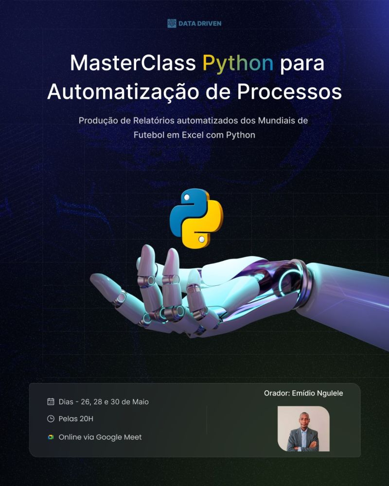

#  MasterClass: Python para Automatização de Dados do Mundial de Futebol – 1ª Edição 

## 📌 Descrição

Bem-vindo ao repositório oficial da **MasterClass Python para Automatização de Dados do Mundial de Futebol**!

Esta Masterclass foi desenvolvida para capacitar você no uso de **Python** para automatizar tarefas repetitivas, como a produção de relatórios, gráficos e dashboards usando dados históricos dos Mundiais de Futebol. A automatização será feita integrando **Python** com **Excel**, permitindo transformar dados brutos em **insights estratégicos e visuais** de forma simples, prática e eficaz.

---

##  Datas e Horário

- **Dias**: 26, 28 e 30 de Maio de 2025  
- **Horário**: 20h (GMT)  
- **Plataforma**: Google Meet (100% online)

---

##  Objetivo da Masterclass

O objetivo principal é **automatizar a análise e geração de relatórios do Mundial de Futebol**, utilizando bibliotecas Python.
---

##  Projeto Prático

Durante a Masterclass, você irá:

- Ler e tratar dados reais sobre Copas do Mundo
- Automatizar relatórios de desempenho por país, jogador, ano, etc.
- Gerar dashboards com gráficos interativos e KPI em Excel
- Agilizar a produção de relatórios com  Python

Para acompanhar a MasterClass, você precisará ter instaladas as seguintes ferramentas:

- Python - [https://www.python.org/downloads/](https://www.python.org/downloads/)
-  VS Code -[https://code.visualstudio.com/](https://code.visualstudio.com/)
-  Anaconda ) -[https://www.anaconda.com/products/distribution](https://www.anaconda.com/products/distribution)

